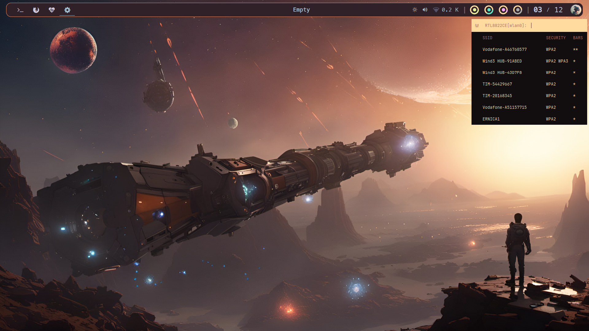
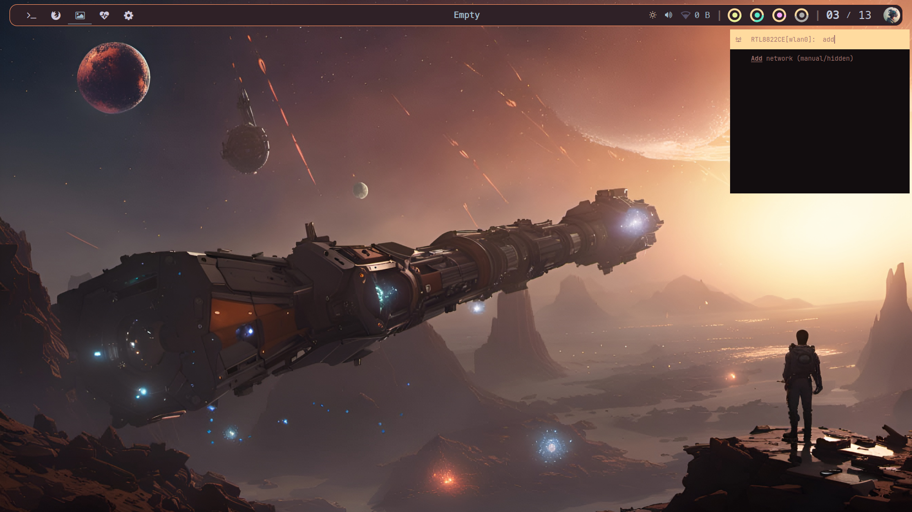
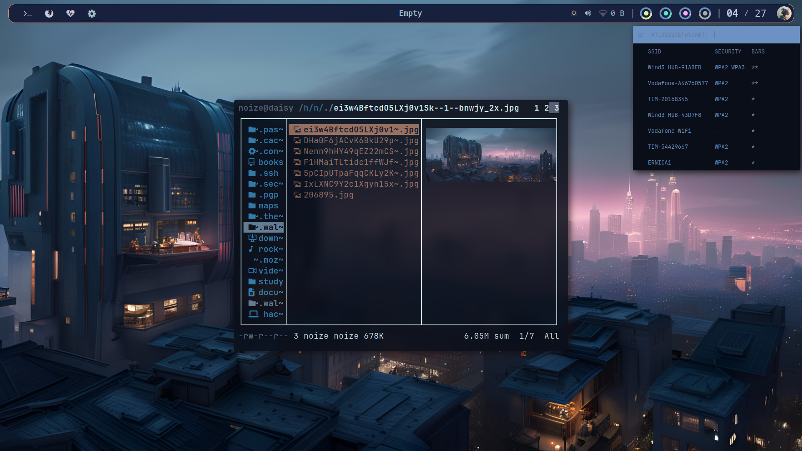
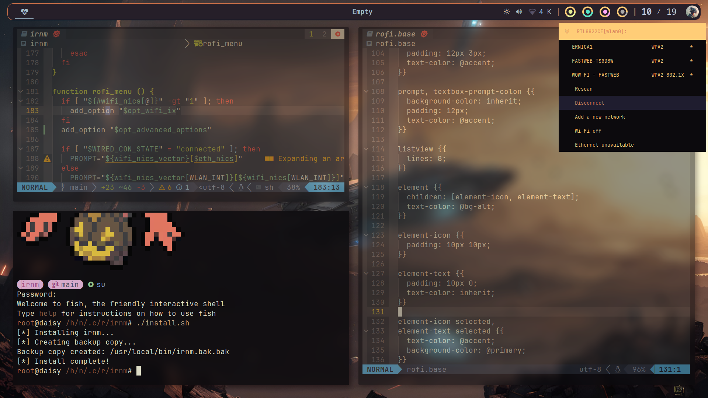
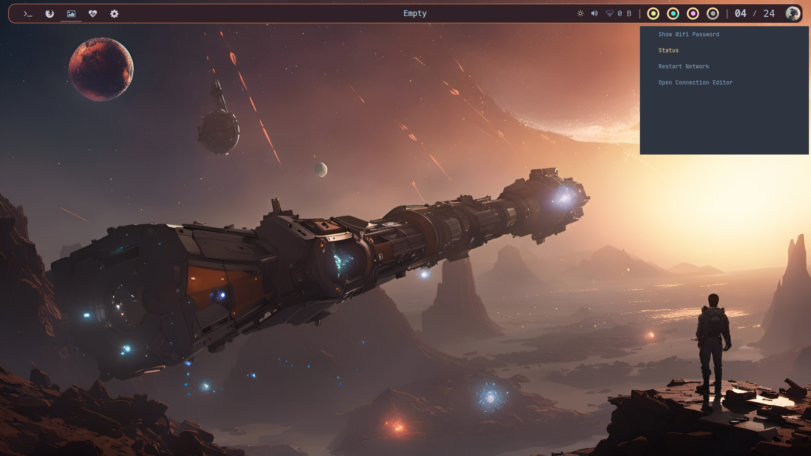
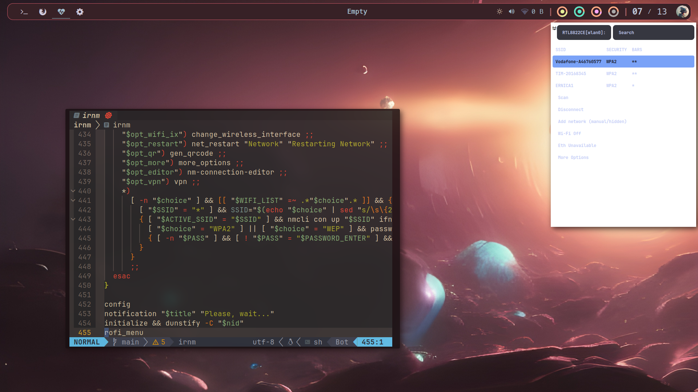

# irnm - improved rofi-network-manager
## rofi interface utility for NetworkManager

### Dependencies

```
sudo pacman -S bash
yay -S rofi dunstify
```

### Installation

```
cd ~/.config/rofi
git clone https://github.com/cherrynoize/irnm irnm
cd irnm
chmod +x install.sh
./install.sh
```

### Usage

```
irnm
```

### Theming

You can set up your `rofi` theme in `config.rasi` like this:

```
@theme /path/to/theme.rasi
```

since `irnm.rasi` imports `~/.config/rofi/config.rasi` by
default (you may want to edit that out if that's not what you
want or if your config sits in another path). Or you can add a
theme directive right in there to be used with `irnm` only.

If you want to integrate a `wpgtk` theme such as the one provided,
you're going to need to set up a [template](rofi.base). Refer to
[Deviantfero's documentation](https://github.com/deviantfero/wpgtk/wiki/Templates)
for that.

### Screenshots

# [wpgtk](wpgtk.rasi)
<details>
<summary></summary>





</details>

<details>
# <summary>[Nord](https://github.com/Murzchnvok/rofi-collection)</summary>
# [Nord](https://github.com/Murzchnvok/rofi-collection)</summary>


</details>

<details>
# <summary>Saturn</summary>


</details>

### TODO

#### Meta
- Make a better install script so that it also installs config
files some other place. (Always be careful not to override stuff!)
- Uninstall script

#### Features
- Create hotspot functionality
